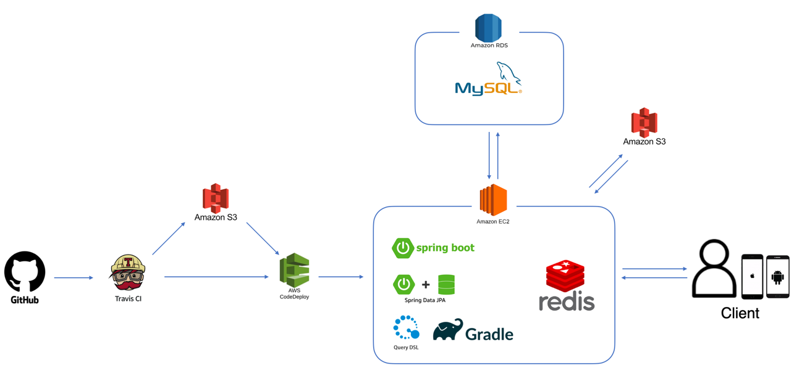
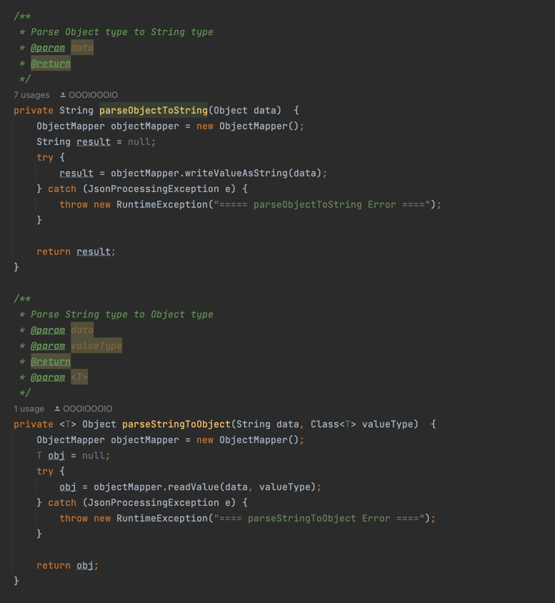

# Do you like chicken?

## 개요

#### 고물가 시대! 점점 치솟는 치킨값... 그래서 준비했습니다!   치킨 브랜드와 메뉴를 소개하여 어떤 치킨이 제일 맛있는지! 어떤 치킨을 제일 좋아하는지! 좋아요로 표현해주세요!

## Skills
- **Java 11**
- **Gradle 8.2**
- **Spring Boot 2.7.6, Spring Security, Spring Data JPA**
- **Querydsl 5.0.0**
- **MySQL 8.0.31**
- **Redis**
- **JWT**
- **AWS EC2, RDS, S3, Codedeploy**
- **Travis CI**
- **Docker**
- **Swagger 3.0**
- **Domain Driven Design**
- **Layerd Architecture**
- **RESTful API**
- 
## Architecture

## ERD

## Code

#### parsing 메서드

#### redis - db 정합성 맞추기

## 느낀점
-