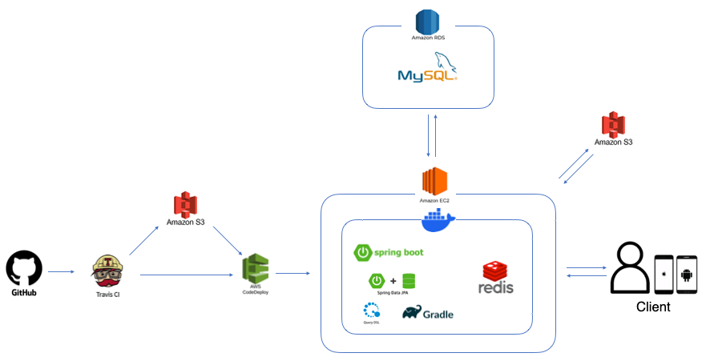
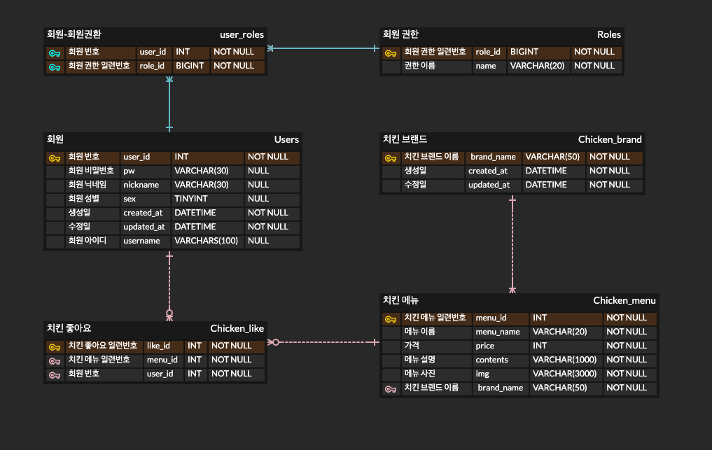
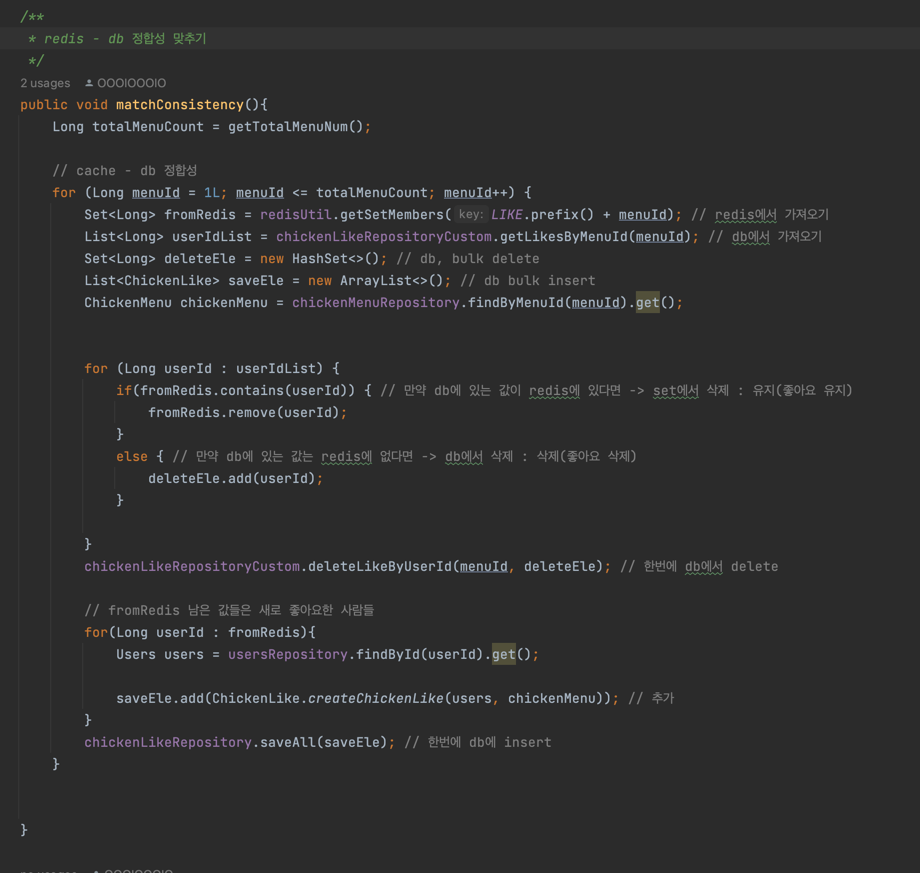

# Do you like chicken?

## 개요
> 고물가 시대! 점점 치솟는 치킨값... 그래서 준비했습니다! 
> <br>치킨 브랜드와 메뉴를 소개하여 어떤 치킨이 제일 맛있는지! 어떤 치킨을 제일 좋아하는지! 좋아요로 표현해주세요!

<br>
<hr>
<br>

### 역할 및 기간
- **개인 프로젝트**
- **2023.10.04 ~ 2023.12.28**

<br>
<hr>
<br>

## 시작 가이드

```html
1. git clone this repository
2. write application-real.yml
3. run this project
```
- [Check out application-real.yml file](https://github.com/OOOIOOOIO/Do-you-like-chicken/wiki/application%E2%80%90real.yml)

<br>
<hr>
<br>

## Skills
- **Java 11**
- **Gradle 8.2**
- **Spring Boot 2.7.6**
- **Spring Security**
- **Spring Data JPA**
- **Querydsl 5.0.0**
- **MySQL 8.0.31**
- **Redis**
- **JWT**
- **AWS EC2, RDS, S3, Codedeploy**
- **Travis CI**
- **Docker**
- **Swagger 3.0**
- **Domain Driven Design**
- **Layerd Architecture**
- **RESTful API**

<br>
<hr>
<br>

## Architecture



<br>
<hr>
<br>

## ERD


<br>
<hr>
<br>

## API 목록


<br>
<hr>
<br>

# Code

## redis 와 MySQL 정합성 맞추기

- controller


- match consistency method


- bulk insert method


- **문제상황**
  - **치킨에 대한 좋아요 수를 Redis와 MySQL을 사용해 함께 관리했습니다. 좋아요의 경우 DB IO가 많이 발생하여 성능에 영향을 줄 수 있기에, inmemory인 Redis를 통해 캐싱을 수행했으며, 좋아요 정보를 영구 저장하기 위해 RDBMS를 사용했습니다.<br>
하지만 저장소 2개를 이용해 데이터를 관리하다보니, Redis와 MySQL에 저장된 데이터가 불일치하는 문제가 발생했습니다.**
- **해결방법 및 실행**
    - **Caching 전략 중 Cache-Aside와 Write-Back 전략을 사용했습니다.<br>
우선 Cache-Aside 전략을 통해 DB IO를 줄이고 좋아요 빠르게 응답을 보여줄 수 있었습니다. 다음으로 Write-Back 전략을 통해 Redis와 MySQL의 정합성을 맞췄습니다. Spring Scheduler를 사용해 매 00시 정각에 Redis에 저장된 정보를 DB에 저장된 정보와 비교하여 데이터를 일치시킨 후, 일치된 데이터를 bulk insert를 통해 redis에 저장했습니다.**
- **성과**
    - **Redis의 개념과 조작법을 습득했습니다. 또한 Pipelining을 통한 redis bulk insert를 수행함으로써 네트워크 병목현상 개선에 대해 고민하고 Redis의 특성을 학습한 뜻깊은 시간이었습니다.**
    - **직접 적용하며 DB IO에 대한 성능 이슈에 대해 고민할 수 있었습니다.** 
    - **Java와 Redis 통신 사이 직렬화, 역직렬화를 수행함으로써 직렬화와 역직렬화의 개념 습득했습니다.**


<br>
<hr>
<br>

## redis를 통해 데이터 캐싱하기
- warm up controller

- warm up method

- Read-Through method 


- **문제상황**
  - **치킨 메뉴 리스트와, 치킨 메뉴 상세정보, 등 불변 데이터를 조회할 때 DB IO를 항상 요청하기에 불필요한 DB IO가 발생한다고 생각했습니다.**
- **해결방법 및 실행**
  - **Admin에서 CacheWarmUp을 통해 불변 데이터를 미리 Redis에 삽압하고, Caching 전략 중 Read-Through Cache 전략을 사용했습니다.<br>
WarmUp을 통해 캐싱된 데이터를 조회하고 만약 캐시에 데이터가 존재하지 않을 시 DB에서 데이터를 불러오고 Redis에 밀어 넣었습니다.**
- **성과**
  - **Caching을 하는 이유와 Caching 전략이란 무엇인지에 대해 학습하고, 캐싱을 통해 빠른 성능 체감 및 DB IO 최소화의 중요성 체감했습니다.**
  - **불변 데이터 및 불특정 다수가 반복 요청하는 데이터를 캐싱을 통해 DB IO 최소화하는 법을 습득했습니다.**


<br>
<hr>
<br>

## 다양한 쿼리 테스트를 통한 쿼리 최적화(치킨 메뉴 리스트 조회)
- Repository


- Test
  - JPA Fetch join 사용

  - Native Select절 subquery 사용

  - Native Join절 group by 사용


- **문제상황**
  - **우선 JPA의 fetch join 사용하여 메뉴 리스트를 조회 쿼리를 조회했습니다. DB에서 데이터를 가져온 후 메모리에서 DTO로 맵핑해주었습니다. 각 테이블에 데이터 수가 적을 경우(100단위) 문제없이 데이터를 불러왔습니다.<br>
하지만 데이터의 수가 10만단위로 갈 경우 응답시간이 6821ms 그리고 결국 Time over이 발생했습니다.**
- **해결방법 및 실행**
  - **JPA를 사용하기에 그리고 fetch join이 편리하다고 해서 JPA 너무 매몰된 경향이 있었습니다. 성능을 향상시키고자 native 쿼리를 사용하기로 결정했습니다.**
  - **1)select절 subquery, 2)join절 group by를 사용하여 테스트를 진행했습니다.**
    - **select절의 경우 10만 단위 기준 161~198ms**
    - **join절 grooup by의 경우 10만 단위 기준 178 ~ 220ms의 응답시간이 도출되었습니다.**
- **성과**
  - **편한 기술에 매몰되지 않고 성능을 위해 다양한 방법을 고민하고 노력한 점**
  - **데이터 양과 SQL쿼리에 따른 응답시간의 결과를 측정하여 SQL 쿼리 최적화 테스트 수행 및 이를 통한 응답시간을 Time out → 161ms로 향상시킨 경험**


<br>
<hr>
<br>

## 회고
RDMBS와 NoSQL에 대해 이해하고 더욱 깊이 생각할 수 있는 생각이었습니다. 백엔드의 경우 데이터 정제 및 가공을 어떻게 할 것인지, DB IO를 최적화하여 성능을 향상시킬 수 있어야 한다고 생각합니다.<br>
성능 향상을 위해 다양한 방법으로 쿼리를 테스트하고 조회 성능을 향상시킨 점, 캐싱을 통해 DB IO를 최적화하는 법을 학습하고 직접 개발하며, 성능 향상에 대한 고민을 할 수 있는 점에서 뜻깊은 시간이었습니다.


### 아쉬웠던 점
- **배포는 했지만 유저 수가 얼마 되지 않아 트래픽 이슈나 운영 이슈를 경험해보지 못한 점**
- **로컬에서 Docker를 사용해 개발환경을 구축했지만 AWS 메모리 이슈로 인해 도커를 이용해 배포를하지 못한 점**


